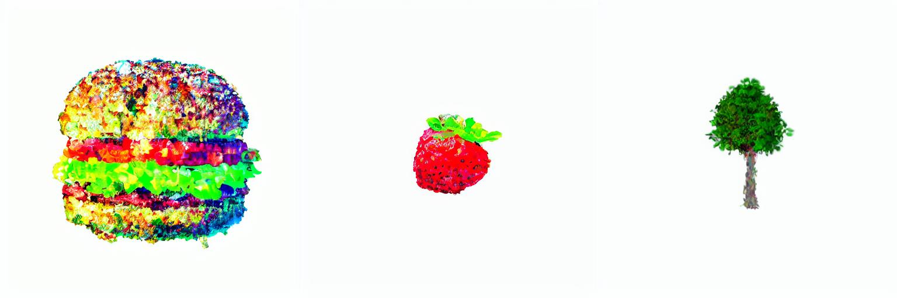

# 🌀 SDS-GS : Basic implementation of SDS for Gaussian splatting

[](./LICENSE)
[](https://www.python.org/)

> A free minimal reimplementation of [DreamGaussian](https://arxiv.org/pdf/2309.16653), using **Stable Diffusion v1.5**, **gsplat**, and **Point-E**.

---

## 🎯 Overview

**DreamGaussian-SDX** is a lightweight reimplementation of [DreamGaussian: Generative Gaussian Splatting for Efficient 3D Content Creation](https://arxiv.org/pdf/2309.16653).  
It generates 3D content from a text prompt by optimizing a 3D Gaussian splatting using Score Distillation Sampling (SDS).

This version integrates:

- 🎨 **[Stable Diffusion v1.5](https://huggingface.co/stable-diffusion-v1-5)** as a text-to-image prior for SDS optimization.
- 🟡 **[gsplat](https://github.com/nerfstudio-project/gsplat)** for fast and differentiable 3D Gaussian rendering.
- 🔷 **[Point-E](https://github.com/openai/point-e)** to optionally initialize a point cloud from text.

---

## 🖼️ Results

<!--  -->



---

## 🚀 Installation

Clone the repository and install dependencies:

```bash
# Clone the repository
git clone --recursive https://github.com/GeogeoB/SDS-GS.git
cd SDS-GS

#Create and activate an environment
python -m venv SDS-GS-env
source SDS-GS-env/bin/activate

# Install package
pip install torch torchvision torchaudio --index-url https://download.pytorch.org/whl/cu128 # Install the correct version for your system
pip install diffusers
pip install gsplat

# Install point_e packages
cd libs/point_e
pip install -e .
cd ../..

pip install scikit-learn
pip install transformers
```

Make sure you also install:
- gsplat
- Point-E

Follow their installation guides as needed.

## ⚙️ Usage

Example command:

```bash
python SDS-generation.py --prompt "a cat" --device cpu --save_dir results --use_epoint
```

### Arguments


| Argument       | Description                                        |
| -------------- | -------------------------------------------------- |
| `--prompt`     | Text prompt to guide 3D generation                 |
| `--device`     | Choose between `cpu` or `cuda`                     |
| `--save_dir`   | Directory where results are saved                  |
| `--use_epoint` | If set, initializes the scene using Point-E output |


## 📄 License

This project is licensed under the MIT License.
Feel free to use, modify, and share it.

## 🙌 Contributing
Pull requests are welcome!
Feel free to open an issue for bugs, ideas, or discussions.